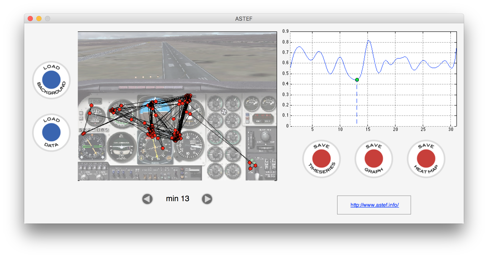

# ASTEF: A Simple Tool for Examining Fixations.

Official website: http://astef.info

## Overview
A Simple Tool for Examining Fixations (ASTEF) is a project for facilitating the use of spatial statistics on eye tracking data. The first version of the software was developed in C# and it is no longer maintained. This version is coded for Matlab. The interface has completely redesigned and simplified.

## Fixation Data Format
Fixation file has to be a simple text file, .txt extension, space-delimited.

First line: screen width and height, in pixel.

From second line to the end: timestamp, and x y coordinates of each fixation

Example:
```
1024 768
1083 369 482
1684 388 546
1856 359 589
2264 337 684
3212 340 854
3576 380 433
```
## Screenshots



## Available programming languages

Current:
* Matlab

Planned:
* web app

If you want to contribute to the web application, port ASTEF in other programming languages, or improve the existing versions, please contact us!

## Publications
* Di Nocera, F., Capobianco, C., & Mastrangelo, S. (submitted). A Simple(r) Tool For Examining Fixations.
* Camilli, M., Nacchia, R., Terenzi, M., & Di Nocera, F. (2008). [ASTEF: A Simple Tool for Examining Fixations.][df1] Behavior Research Methods, 40(2), 373-382.
* Di Nocera, F., Camilli, M., & Terenzi, M. (2007). [A random glance at the flight deck: pilot’s scanning strategies and the real-time assessment of mental workload.][df2] Journal of Cognitive Engineering and Decision Making, 1(3), 271-285.

[df1]: http://link.springer.com/content/pdf/10.3758/BRM.40.2.373.pdf
[df2]: http://edm.sagepub.com/content/1/3/271.full.pdf
